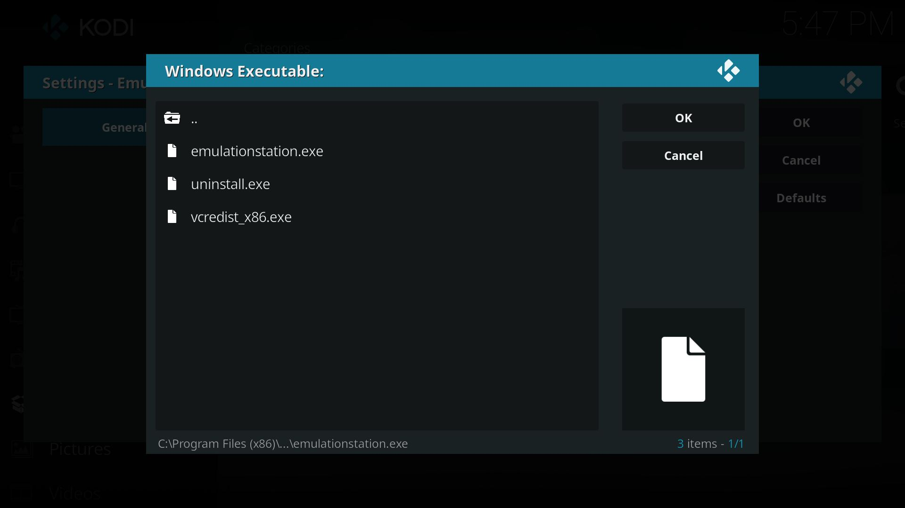

# Kodi Launches EmulationStation Addon
Addon for Kodi to launch EmulationStation on Windows and Linux (platforms were EmulationStation have official support).

Our goal is to bring to Kodi an easy access to launch this fantastic emulator front-end which provides a beautiful interface to run your roms from more than 50 systems (and counting) with personalized skins and art boxes. You can navigate on its menus using a controller which is perfect for a complete HTPC experience, also it has a built-in metadata scraper that lets you easily download game box art, correct titles, description and even ratings about your games. EmulationStation is cross-platform, and completely open source.

This Addon support Kodi 19 (Matrix) and newer.
This Addon is available in 3 languages: English, French and Spanish. To switch to any language, change it on the configurations of Kodi at `Settings -> Interface settings -> Regional -> Language`.

## Usage
Use this Addon on Kodi if you want to launch EmulationStation from it using a nice interface created with original images taken from the program itself and games. It works on any platform where Kodi and EmulationStation can be installed (Linux and Windows).

**Notes:**
This Addon is just a launcher, so it assumes that you already have installed and configured EmulationStation on your system. It will not assist you to install, configure EmulationStation or download ROM's or BIOS's for it. You need to provide them by your own. This Addon does not collect any kind of hardware/software information, usage statistics or any kind of data from you or your system; we respect your privacy.

## Installation

#### Prerequisites
First, you need to install Kodi. To download and install it go to https://kodi.tv/
After that you need to install and configure EmulationStation. To download it and get instructions based on your operating system, go to https://emulationstation.org/gettingstarted.html and to configure EmulationStation go to https://emulationstation.org/gettingstarted.html#config (basically what you need to do is to edit XML files to set the ROM paths for each system and set the location of the emulator-manager you want to use, such as *RetroArch*, and add your ROM's).

#### Steps
1. Download the Addon:
   This Addon is not registered on any official or unofficial Kodi repositories yet, hopefully it would be in the future. For now the way to install this Addon is to install it from a zip file.
   Go to this page https://github.com/ArthurBorsboom/Kodi-Launches-EmulationStation-Addon/releases and download the latest zip file available.

2. Start Kodi and navigate to `Settings -> Add-ons -> Add-on browser -> Install from zip file`, on the file browser look for the zip file you downloaded on the previous step and select it. Installation is going to start and Kodi will show a notification when this is done.
   **Note:** If preference is not checked, Kodi will ask you to allow installations from zip files as a security measure. Change your preferences to allow installations from zip files and continue with the installation. Also please notice that this options can be displayed on different paths depending of the Kodi skin you are using. The path used above is a generic one that may or may not be on your skins, but in any case it is not hard to find.

3. Once the Addon is installed, navigate to `Program Add-ons` and you will see EmulationStation listed there.   

   

4. Before running the Addon, you need to set the location of the EmulationStation executable, the default location for Windows is `C:\Program Files (x86)\EmulationStation\emulationstation.exe` while for Linux it is `/usr/bin/emulationstation`. If you installed EmulationStation on a different location, you can choose your own location by going to the Addon-Settings by selecting the EmulationStation Addon, bringing up the contextual menu by right-clicking it (or pressing the `Guide` button on a remote, pressing `C` key on a keyboard, pressing `X` button on Xbox or Steam Controllers or `Square` button on PayStation controllers) and selecting `Settings` or `Configure`.

   

   The next window will show you the `EmulationStation executables` properties that you can select and change them by navigating on the file browser. You only need to edit the executable property of the OS you are running since the other would be ignored. The Addon checks which OS is running and will call the corresponding executable. If you provided an executable that doesn't exist anymore, the next time you try to run it the Addon will show you an error message suggesting you to go to the Addon-Settings and change it.   

   

5. Enjoy!

## Troubleshooting

##### Emulators not visible or starting underneath Kodi
When Python within Kodi starts a new command like the EmulationStation program, it doesn't provide a terminal where emulators can connect and be displayed. As for version 1.1.4 we implemented a solution for Linux users by running Xterm which calls EmulationStation executable and this provides a TTY for emulators to connect to. Xterm location is set as default, but if you have it on a different path, you can change it on the Advanced tab of the Addon Configuration.

Sometimes, because Kodi is in fullscreen, emulators will start underneath Kodi's window and not become visible. This can be worked around by exiting Kodi's fullscreen when EmulationStation starts and returning to Kodi's fullscreen after EmulationStation closes. As for version 1.1.4, this option has been added on the Advanced tab of the Addon Configuration.

##### Screen turning off or computer enters in sleep mode
On some systems, EmulationStation will not preven Kodi from sleeping or shutting down. A workaround has also been added and a switch was added on the Advanced tab of the Addon Configuration.

##### Advanced tab of the Addon Configuration
Here you can find the Advanced tab of the Addon Configuration, set the values and switches as needed if you face one of the mentioned issues:

